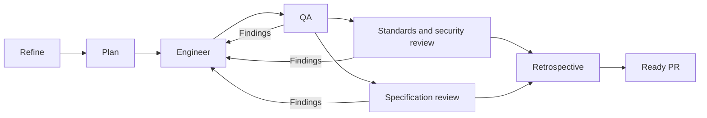

# Implementation workflow

Agreed on 2026-10-07. This is the shared workflow for implementing one GitHub issue. The AI harness supplies isolated agents and interactive questions; the repository controller owns stage order, durable state, evidence, and publication gates. Provider SDKs and paid inference are outside the controller.

## Entry and setup

Use `/implement <issue>` in Claude Code or OpenCode, or `$implement <issue>` in Codex. A harness without a registered command can read `.agents/skills/implement/SKILL.md` explicitly. It must support isolated delegation and owner questions to execute this workflow; it cannot substitute one agent impersonating every role.

The controller runs on the host with Node.js 24 or newer, installed repository dependencies, Git, RTK, an authenticated GitHub CLI with repository/Project access, and Docker Compose. Application verification runs in containers. Missing local tooling or credentials must be resolved before dependent work proceeds.

`CLAUDE.md` imports `AGENTS.md`. Native command and agent registrations contain metadata and pointers to these shared instructions. Configure registrations with `npm run workflow:adapters -- configure --harness <codex|claude|opencode> --profile <openai|anthropic>`. Use `doctor` to inspect the configuration and `--dry-run` to preview changes. Do not overwrite unrelated harness configuration or provision provider accounts.

Codex explicitly dispatches its registered Coordinator. Claude's command forks the registered Coordinator; nested delegation must be enabled to at least two layers. OpenCode's command selects the primary Coordinator. Confirm the effective Coordinator model and effort before starting. When a nested agent cannot ask directly, the outer conversation relays its recorded questions to the Owner and resumes it with the actual answer reference. Preserve the requested model on resumed sessions. A Claude main-thread alternative is `claude --agent coordinator`, which can ask directly.

Keep local source configuration in the gitignored `.agent-workflow/config.json`. Configure the GitHub repository, specification issue (normally #1), selected model profile, and approved private PRD locator and local path. An approval assertion records an existing Owner decision; it does not approve a document. The Owner supplies missing access or approval. Run `npm run workflow -- help` for the current configuration schema and flags.

```json
{
  "repo": "pabloquadrado/eleggante-tournament-management",
  "specIssue": 1,
  "profile": "openai",
  "prd": {
    "path": "/absolute/path/to/approved-prd.md",
    "locator": "Private team vault: approved Arena Eleggante PRD",
    "approved": true
  }
}
```

```sh
npm run workflow -- start 4 --dry-run
npm run workflow -- start 4
npm run workflow -- status <run-id>
npm run workflow -- next <run-id>
npm run workflow -- resume <run-id>
```

The dry run reads sources and previews dispatch/blockers without creating a run, worktree, branch, issue comment, or PR. A normal start isolates work from the latest remote `main`. The controller preserves unrelated working-tree changes.

## Roles and stages

Load a role's document only when dispatching that role. Read the input packet and its source pointers, not the full conversation history. The Tech Lead handles refinement and planning as separate stages.

| Stage          | Role instruction                        | Required outcome                                                                 |
| -------------- | --------------------------------------- | -------------------------------------------------------------------------------- |
| Coordination   | [Coordinator](roles/coordinator.md)     | Durable dispatch, owner questions, validated handoffs, publication               |
| Refinement     | [Tech Lead](roles/tech-lead.md)         | Current approved requirements and acceptance examples with source references     |
| Plan           | Tech Lead                               | Technical plan comment and Mermaid sequence diagram                              |
| Implementation | [Senior Engineer](roles/engineer.md)    | Tested feature, required docs, passing engineering gate                          |
| QA             | [QA](roles/qa.md)                       | Independent coverage run, behavior analysis, regression tests, findings resolved |
| Review         | [Reviewer](roles/reviewer.md)           | Both Standards/security/reliability and Spec reviews pass                        |
| Retrospective  | [Delivery Lead](roles/delivery-lead.md) | Evidence-based report and proposed improvements                                  |
| Ready          | Coordinator                             | Final-commit local gates and CI pass; PR ready for Owner                         |



QA can prepare its scenario matrix from the approved plan while the Engineer implements. Its final analysis uses the completed code. The two review checks run in parallel after QA passes. Cap concurrency at the harness limit; the default target is three child agents. The Engineer is the single production-code owner. QA writes regression tests in a separate worktree; the Coordinator integrates them and the Engineer fixes production behavior. Reviewers remain read-only.

## Reports, questions, and recovery

`next` emits the permitted stage, role, source fingerprint, commit, model settings, source pointers, and a report template. Use that template rather than inventing a report shape. `record <run-id> <report-path>` validates the report before advancing. Full findings and evidence live in run artifacts; the agent returns a compact summary and artifact paths.

After the plan report passes, call `publish <run-id>` to set Project In Progress and publish its development-plan comment. Only then does `next` dispatch implementation. Call `publish` again at the ready stage for final delivery; the operation resumes its recorded steps on retries.

After engineering passes, `publish` can push the candidate and create its draft PR before QA. It remains draft through QA, review, retrospective, and CI. Final `publish` records sanitized summaries and marks ready.

Every report identifies the native session and requested/effective model and effort, distinguishes findings from questions, and cites commands, observable behavior, or source passages. A separate `publicSummary` contains material suitable for the issue/PR; detailed `summary`, evidence paths, and native receipts remain local. Passing percentages or an agent's statement that tests passed cannot replace controller-generated verification evidence. Unavailable usage measurements remain unknown; do not estimate savings or costs as measured facts.

Investigate the repository, issue history, approved PRD, and specification before asking. If a doubt remains, record it through `question` and ask the Owner through the harness. Stop dependent work until an actual Owner answer is recorded through `answer`. A timeout, canceled prompt, missing answer, agent inference, or model escalation is not approval. Changed product decisions and disputed findings must be answered before becoming requirements or deferrals.

Record the native user-response reference with `answer --user-ref`. A proposed finding deferral uses `question --finding <finding-id>` and an explicit `answer --approve-deferral` or `--deny-deferral`; an unrelated answer cannot authorize it. Use the current CLI help for argument order.

Allow two automatic Engineer repair rounds per failed QA or review gate. Counters survive resume. The originating QA/reviewer verifies a correction; the Engineer cannot close its own findings. The Owner can approve a documented deferral or authorize further attempts. Code changes invalidate downstream results. Changed input sources invalidate dependent stages and require reconciliation with the existing work.

Resume checks sources, commit freshness, outstanding questions, and recorded publication steps. Atomic writes and run locks protect state. Investigate an abandoned lock before recovery; do not run concurrent coordinators against the same run. Preserve the worktree and evidence when blocked.

Local run artifacts and nested worktrees are excluded from Git, Docker build context, TypeScript, ESLint, and architecture scans. They are runtime evidence, not application source.

## Models and token use

The model registry in `scripts/agent-workflow/models.ts` is the executable source of truth; `npm run workflow -- profiles` displays it. The agreed profiles use Sol or Opus 5.5 at `xhigh` for Tech Lead, Engineer, QA, and Reviewer, and Luna or Haiku 5.5 at `max` for Coordinator and Delivery Lead. Kimi K3 at `max` is an optional Engineer override where the harness supports it. These are alternative provider presets, not a requirement to mix providers in one session.

Validate account/harness model and effort support before dispatch, and record the actual settings. Missing support pauses the run; there is no silent substitution. Coordinator and Delivery Lead may escalate once to their profile's Sol/Opus setting when they cannot satisfy their role contract. Escalation does not reset repair limits or answer product questions.

Record escalation with `npm run workflow -- escalate <run-id> coordinator|delivery-lead --reason "<observed limitation>"`. Dispatch a fresh native session at the returned settings and retain its receipt. The controller rejects a second escalation for the same role.

Keep context focused through source pointers, selective reading, isolated sessions, compact summaries, and deterministic checks. Use reported token/cache statistics where available. Higher effort is the Owner's chosen default; subsequent changes require measured evidence and Owner approval.

Primary sources for the settings and adapter contracts: [OpenAI models](https://developers.openai.com/api/docs/guides/latest-model), [Codex subagents](https://learn.chatgpt.com/docs/agent-configuration/subagents), [Anthropic effort](https://platform.claude.com/docs/en/build-with-claude/effort), [Claude subagents](https://code.claude.com/docs/en/sub-agents), [OpenCode V2 agents](https://opencode.ai/v2/docs/agents/), [Kimi effort](https://platform.kimi.ai/docs/guide/use-reasoning-effort).

## Verification and delivery

Use `verify <run-id> engineering` for build, type checks, lint, architecture, and full application coverage. QA uses `verify <run-id> qa` for a fresh independent full coverage run. Verify 100% statements, branches, functions, and lines for each included Node/browser application file, with the repository's documented exclusions. QA also checks assertion quality and scenarios beyond executed branches. The controller and adapter tests are developer-tool tests; their results do not replace the application's coverage gate.

Verification uses the repository's Docker test service with a separate Compose project for each run. It mounts the assigned checkout, pins the test database, installs that checkout's dependencies, and runs migrations and build before checks that need generated files. Local environment files are copied into isolated worktrees with restricted permissions and remain ignored. The controller stops its database after verification and retains its test volume and logs for diagnosis; recorded recovery commands identify only that run's resources. Docker and the configured local test environment must be available.

`next` provisions QA's separate checkout at the candidate commit. Its report includes that checkout's base and current commits. Committed, dirty, and untracked production changes fail the test-only scope check. New QA tests must reach the delivery branch; integrating them triggers a fresh engineering/QA pass without consuming a failure repair round merely for adding tests.

The issue body remains the durable product contract. Follow `docs/agents/issue-tracker.md`: set Project #1 to In Progress before publishing the plan comment, keep technical plans in comments, and record refinements or unresolved decisions there. Use stable run markers to avoid duplicate comments and PR creation on retries. Publish summaries rather than private PRD passages or raw session logs.

Keep the PR draft until engineering, QA, both reviews, retrospective, and CI pass for its final commit. The retrospective proposes instruction changes; it does not modify the rules governing future runs. Store detailed logs and resumable state locally; publish concise plan, QA, review, and retrospective summaries in the issue/PR. The Owner alone merges. Project status becomes Done only after the implementation reaches `main`.

The current required CI check is `test`, whose workflow runs build, types, lint, developer-tool tests, and full application coverage. `requiredChecks` can name additional required checks in local configuration. Skipped, neutral, failed, pending, or stale required checks cannot mark the PR ready.

Kev is deferred. It is a [decision model](https://github.com/jaredpalmer/kev), and would require separate routing evaluation and calibration. Stage transitions and coverage gates remain deterministic.
