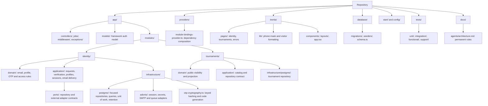
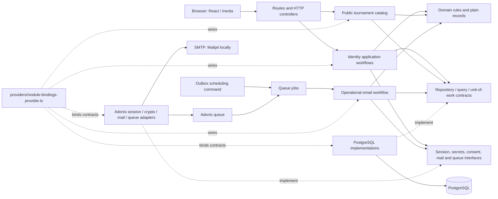

# Code map

This map describes the current code. Domain modules group business rules, application workflows, their interfaces, and concrete infrastructure. AdonisJS directories contain framework entrypoints; Inertia contains the browser presentation.

## Folder organization

## Runtime flow

Solid arrows show calls or data flow. Dashed arrows show implementations and dependency composition.

## Dependency direction

Controllers and jobs import application workflows, never concrete repositories. Application workflows import domain rules and contracts. Infrastructure imports and implements those contracts. The provider chooses concrete adapters. Infrastructure units of work create repositories bound to the same PostgreSQL transaction.

`app/models/user.ts` is the Adonis authentication adapter model, not a domain object. Framework authentication and session middleware integrate with their configured stores at the edge. Business persistence stays in the module infrastructure. Database migrations and seeders own schema and development fixtures.

Identity writes use one unit of work for profile changes, OTP state, sessions, outbox intent, replay results, and audit events. Email delivery uses a separate transaction and locks challenge before outbox; it does not hold the global identity write lock while waiting for SMTP. The browser session is activated only after the identity transaction commits.

## Verification

Japa unit tests cover domain and presentation rules. Integration tests cross HTTP, PostgreSQL, and the mail adapter; functional tests cross Chromium and HTTP. SQL in integration fixtures and persistence invariant assertions remains intentional. Automated delivery tests use `mail.fake()`; an actual Mailpit inbox/API test is not yet part of the automated suite.

`npm run lint` includes the architecture check. It checks import direction and explicit TypeScript source extensions, including dynamic imports; it does not prove every SOLID judgment or database concurrency guarantee. Those require review and behavior tests.
