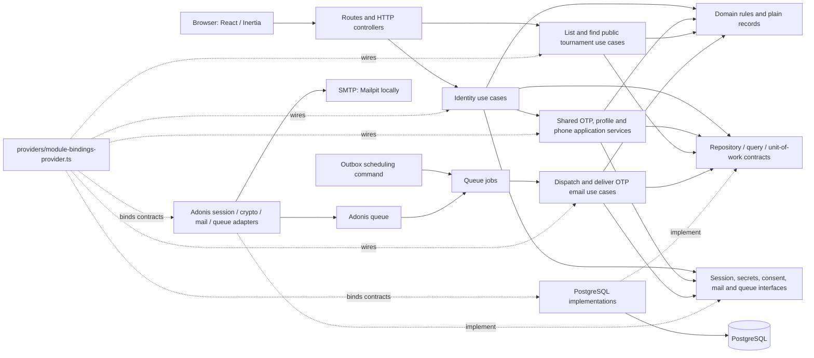

# Code map

This map describes the current code. Domain modules group business rules, application use cases, shared application services, contracts, and concrete infrastructure. AdonisJS directories contain framework entrypoints; Inertia contains the browser presentation.

## Folder organization

```mermaid
flowchart TD
  root[Repository] --> app[app/]
  root --> providers[providers/]
  root --> inertia[inertia/]
  root --> database[database/]
  root --> startup[start/ and config/]
  root --> tests[tests/]
  root --> docs[docs/]
  app --> edges[controllers/, jobs/, middleware/, exceptions/]
  app --> models[models/: framework auth model]
  app --> modules[modules/]
  modules --> identity[identity/]
  modules --> tournaments[tournaments/]
  identity --> idDomain[domain/: email, profile, actor authorization, consent, OTP and delivery policies]
  identity --> idApp[application/]
  idApp --> idUseCases[use-cases/: one class and execute input per application operation]
  idApp --> idServices[services/: OTP creation and consumption, profile reads and updates, phone changes]
  idApp --> idPorts[ports/: repository and external adapter contracts]
  idApp --> idInputs[identity-input.ts: plain profile and phone-operation inputs]
  identity --> idInfra[infrastructure/]
  idInfra --> postgres[postgres/: focused repositories, queries, unit of work, retention]
  idInfra --> adonis[adonis/: session, secrets, SMTP and queue adapters]
  idInfra --> crypto[otp-cryptography.ts: keyed hashing and code generation]
  tournaments --> tournamentDomain[domain/: public visibility and projection]
  tournaments --> tournamentApp[application/]
  tournamentApp --> tournamentUseCases[use-cases/: list and find public tournaments]
  tournamentApp --> tournamentPort[tournament-repository.ts: repository contract]
  tournaments --> tournamentInfra[infrastructure/postgres/: tournament repository]
  providers --> bindings[module-bindings-provider.ts: dependency composition]
  inertia --> pages[pages/: identity, tournaments, errors]
  inertia --> browserRules[lib/: phone mask and visitor formatting]
  inertia --> ui[components/, layouts/, app.tsx]
  database --> migrations[migrations/, seeders/, schema.ts]
  tests --> suites[unit/, integration/, functional/, support/]
  docs --> rules[agents/architecture.md: permanent rules]
```

## Runtime flow

Solid arrows show calls or data flow. Dashed arrows show implementations and dependency composition.

## Dependency direction

Controllers and jobs invoke application use cases through `execute(input)`. Each use case represents one operation and receives plain input and injected dependencies. The HTML and JSON tournament endpoints reuse the same list and find use cases. Pure sign-in rendering, browser-session handling, and queue scheduling remain framework concerns.

Onboarding and full-player profile operations have separate use cases because their access policies differ. Presentation translates the authenticated principal into a plain actor. Use cases invoke the domain actor policy to enforce eligibility before entering the shared profile or phone workflow. The profile reader also checks the current persisted identity; profile and phone confirmation retain their locked-state checks. HTTP errors and page redirects are presentation translations of denied outcomes.

Use cases and shared application services import domain rules and contracts. Infrastructure implements those contracts. The provider chooses concrete adapters and resolves verification with a session adapter scoped to the current request. Infrastructure units of work create repositories bound to the same PostgreSQL transaction.

`app/models/user.ts` is the Adonis authentication adapter model, not a domain object. Framework authentication and session middleware integrate with their configured stores at the edge. Business persistence stays in the module infrastructure. Database migrations and seeders own schema and development fixtures.

The outer use case owns the unit of work. Shared OTP creation, consumption, profile-update, and phone-change services participate through its transaction-bound repositories. Profile changes, OTP state, sessions, outbox intent, replay results, and audit events retain their atomic writes. Invalid OTP attempts are committed before the use case returns a denial. Email delivery uses a separate transaction and locks challenge before outbox; it does not hold the global identity write lock while waiting for SMTP. Verification activates the browser session only after the identity transaction commits.

## Verification

Japa unit tests cover domain and presentation rules. Integration tests cross HTTP, PostgreSQL, and the mail adapter; functional tests cross Chromium and HTTP. SQL in integration fixtures and persistence invariant assertions remains intentional. Automated delivery tests use `mail.fake()`; an actual Mailpit inbox/API test is not yet part of the automated suite.

`npm run lint` includes the architecture check. It checks import direction, explicit TypeScript source extensions including dynamic imports, entrypoint imports through use cases, and a single public `execute` operation on each use-case class. Pure presentation entrypoints can have no use-case dependency. Semantic authorization, transaction correctness, and SOLID judgments require review and behavior tests.
